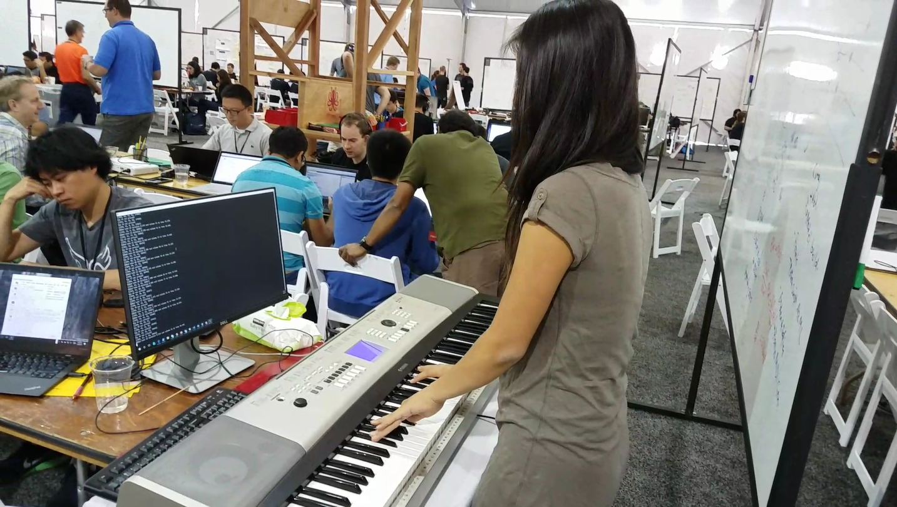
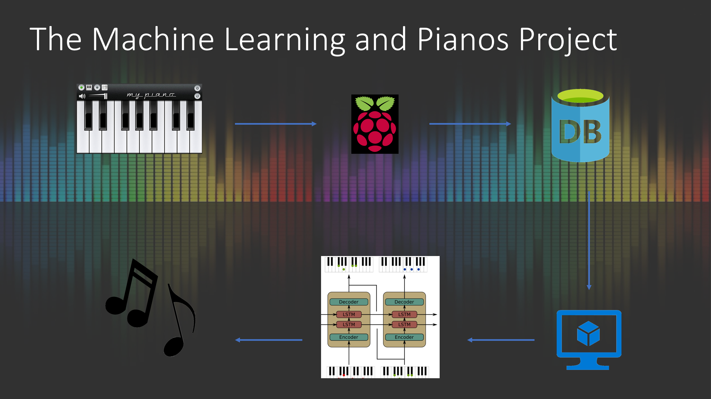

# Machine Learning & Pianos

## The Project
Our vision is to democratize the creation of music. We believe in the power of collaboration and the power of creativity of the masses. Music is one of the creative fabrics that goes beyond language, religion and race. It is truly universal. We believe in giving this power of music creation to all, because that is a beautiful thing for everyone to have.
Whether you are a musician looking to generate creative melodies in your song writing process, or you are someone who is just dabbling into this to get an interesting backing track for your vocals, our project can aid you in music creation based on the training data that it has received. This could potentially be a service offered by Microsoft for generating "creative melodies as a service"

## How it works

This system is made up of:
* Yamaha Portable Grand Piano, with a USB MIDI interface
* Rasbperry Pi 2 Model B 
* USB Wifi adapter
* Python program to create MIDI files and upload to Azure
* Azure blob to store MIDI files
* Azure VM with TensorFlow model to process MIDI files

We created different models that focused on different genres of music, or on different composers (such as Chopin).
* Watch [this](video/Machine%20Learning%20&%20Pianos.mp4) video for a high level explanation of the system and to hear some of the output.
* Watch [this](video/MLP-Tech.mp4) video for a technical explanation of the system.
* Watch [this](video/Frank%20plaiyng%20piano.mp4) video to see one of our members using the system.

## Piano Visualizer

The PianoVisualizer project is an expansion of this project by Frank Cheng to take advantage of the MIDI consumption and create visualizations with it.
